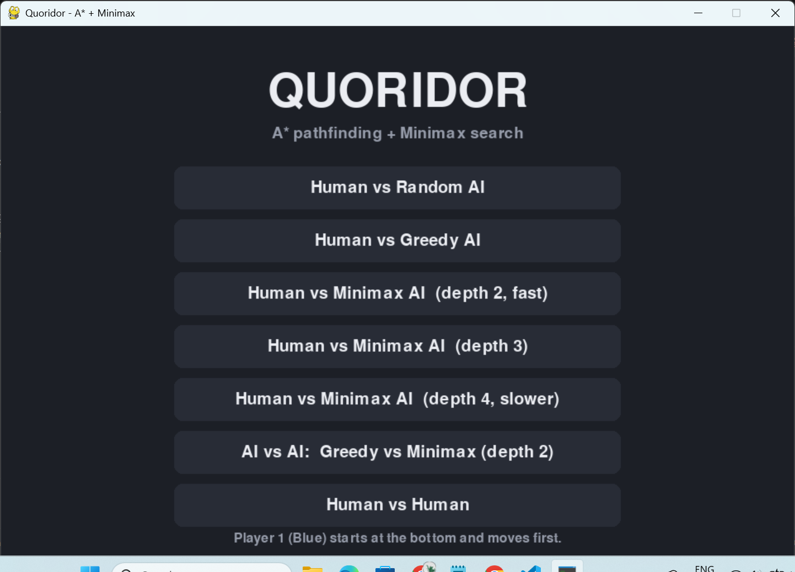
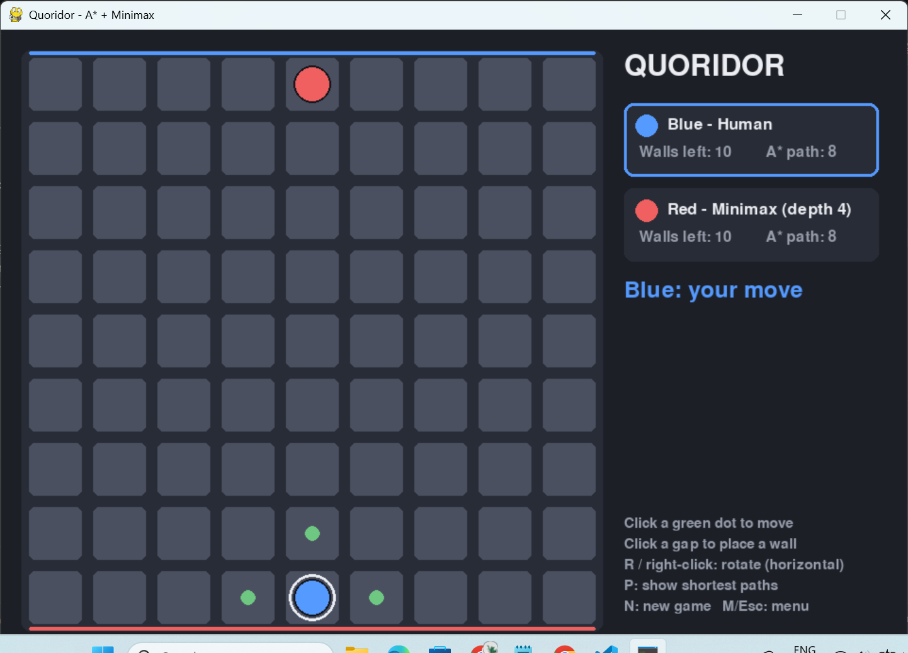

# Quoridor AI  (A* + Minimax)

A playable Quoridor game with a Pygame UI. The AI uses only two algorithms:

* **A\*** - shortest path of each pawn to its goal row. Used for the
  wall-legality rule (a wall may never seal a pawn in) and for the evaluation.
* **Minimax** (plain, no Alpha-Beta) - looks ahead `N` plies and picks the best move.

## Run

    pip install -r requirements.txt
    python main.py                              # start menu
    python main.py --p0 human --p1 minimax:3    # skip the menu
    python main.py --p0 greedy --p1 minimax:2   # watch AI vs AI

Player types: `human`, `random`, `greedy`, `minimax:N` (N = depth).
Blue (player 0) starts at the bottom and moves first; Red starts at the top.

## Controls

| Action | How |
|---|---|
| Move pawn | click a green dot |
| Place wall | click a gap between cells (hover shows a preview: green = legal, red = illegal) |
| Rotate wall at crossing points | `R` or right-click |
| Show A* shortest paths | `P` |
| New game / menu | `N` / `M` or `Esc` |

Over a horizontal gap you get a horizontal wall, over a vertical gap a vertical
wall; `R` only matters when the cursor is on the crossing point of four cells.

## Files

| File | Purpose |
|---|---|
| `game.py` | board state (9x9 pawns + two 8x8 wall arrays), pawn moves, jumps, wall rules, apply/undo |
| `pathfinding.py` | A* |
| `search.py` | evaluation, candidate-wall generation, Minimax |
| `agents.py` | Random, Greedy and Minimax agents |
| `ui.py` | Pygame menu and game screen (AI runs in a thread so the window never freezes) |
| `main.py` | entry point |
| `tests.py` | 23 unit tests (`python tests.py`, no pygame needed) |
| `benchmark.py` | round-robin win rates and time per move |

## How the AI works

**Evaluation** (from the AI's point of view):

    eval = opponent_A*_path - my_A*_path + 0.3 * (my_walls_left - opp_walls_left)

A win scores +1000 (plus a bonus for winning sooner), a loss -1000.

**Move generation.** Plain Minimax can't prune, so the branching factor is
kept small. At each node the AI considers:
* all legal pawn moves (including jumps), and
* only the best `wall_limit` (default 6) candidate walls: walls touching the
  opponent's shortest path or next to the opponent pawn, scored by
  `(opp_path_after - opp_path_before) - (my_path_after - my_path_before)`,
  keeping only walls that gain at least 1.

**Agents**
* `random` - random pawn move, sometimes a random legal wall.
* `greedy` - one-step lookahead using the same evaluation (= Minimax depth 1).
* `minimax:N` - Minimax to depth N.

Typical time per move on a normal laptop: depth 2 ~0.01 s, depth 3 ~0.06 s, depth 4 ~0.4 s.

## Experiments for your report

    python benchmark.py --games 10 --agents random greedy minimax:2 minimax:3 minimax:4

Prints win/loss/draw for every pairing (colours alternate) and average time per move.
